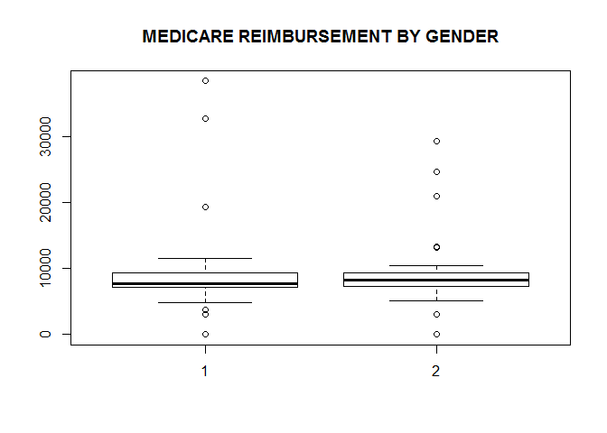
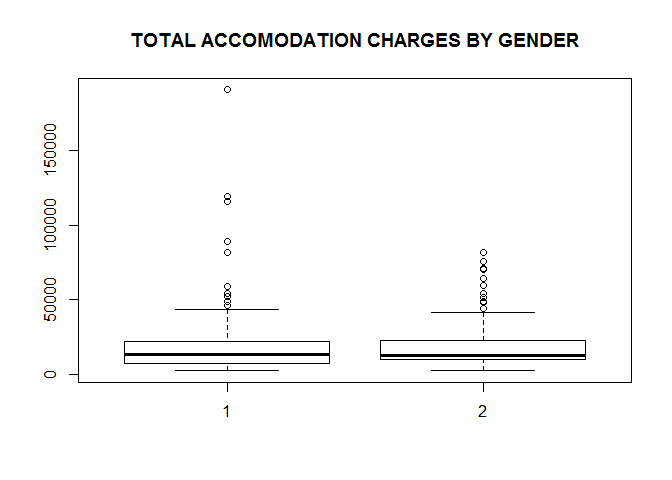
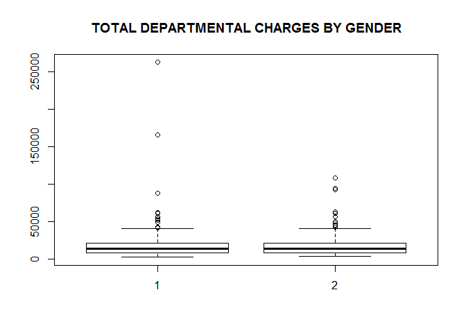
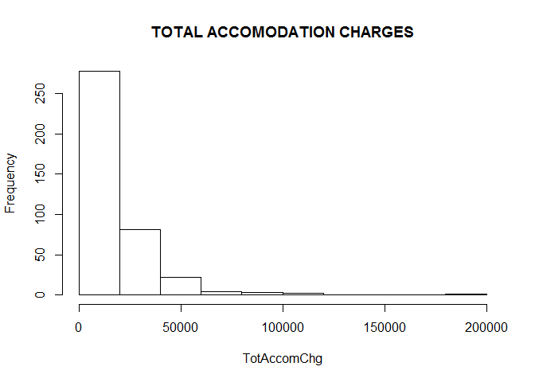
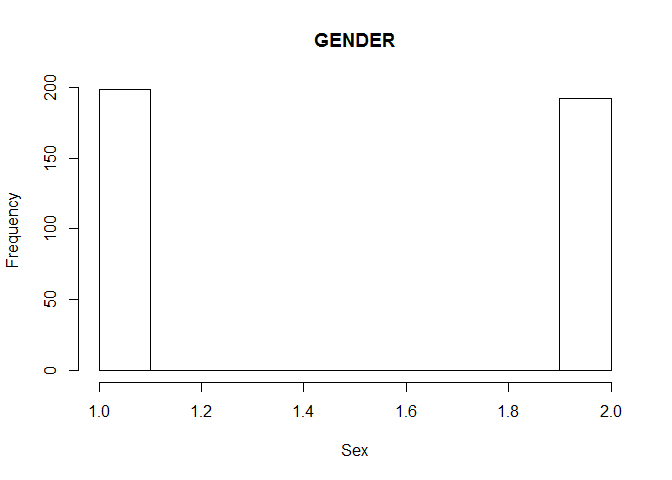
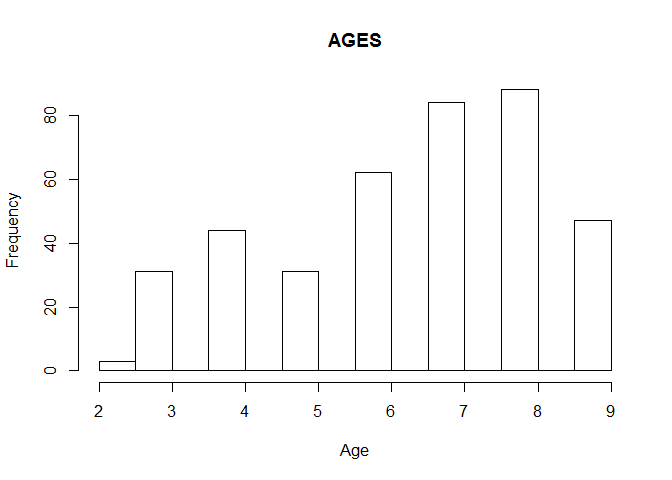
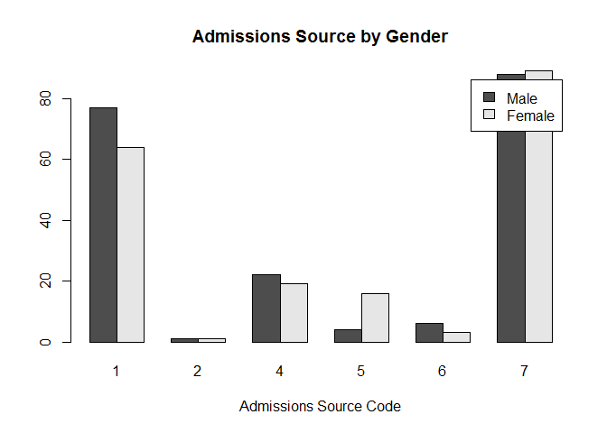
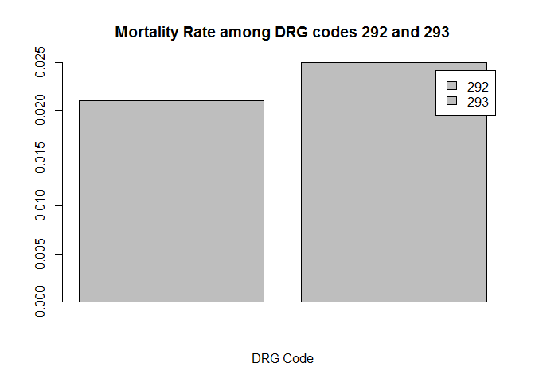

# Live Session Assignment 9
Kevin Cannon  
November 13, 2016  

# Dataset

```r
# read in file
file <- "https://raw.githubusercontent.com/merdirafiei/CHF/master/CHF.csv"
chf <- read.csv(file)
# explore data
head(chf)
```

```
##   Patient LOS Age Sex AmtReim TotAccomChg TotDeptChg NumDxCodes admsrc
## 1       1   8   4   1   10372       19632       8144          9      4
## 2       2   5   4   2   10306       12270      23259          9      1
## 3       3   2   4   2   10306        4908      12834          9      1
## 4       4   2   5   2   10372        4908       5459          9      7
## 5       5   2   3   2    6200        4908       8893          7      1
## 6       6   5   4   1    6186       12270      25758          6      7
##   dischdest drgcode
## 1         6     291
## 2         1     291
## 3         1     291
## 4         1     291
## 5         1     293
## 6         1     293
```

```r
str(chf)
```

```
## 'data.frame':	390 obs. of  11 variables:
##  $ Patient    : int  1 2 3 4 5 6 7 8 9 10 ...
##  $ LOS        : int  8 5 2 2 2 5 7 6 4 8 ...
##  $ Age        : int  4 4 4 5 3 4 6 7 7 7 ...
##  $ Sex        : int  1 2 2 2 2 1 2 2 2 1 ...
##  $ AmtReim    : int  10372 10306 10306 10372 6200 6186 10372 7224 6200 6200 ...
##  $ TotAccomChg: int  19632 12270 4908 4908 4908 12270 18816 14724 9816 19632 ...
##  $ TotDeptChg : int  8144 23259 12834 5459 8893 25758 14516 8105 22244 6506 ...
##  $ NumDxCodes : int  9 9 9 9 7 6 9 4 9 8 ...
##  $ admsrc     : int  4 1 1 7 1 7 7 1 1 4 ...
##  $ dischdest  : int  6 1 1 1 1 1 6 1 6 1 ...
##  $ drgcode    : int  291 291 291 291 293 293 291 293 293 293 ...
```

```r
#attach dataframe
attach(chf)
```

### 1. Show the mean for Amount Paid by Medicare, Total Accommodation Charges, and Total Departmental Charges

```r
mean(AmtReim)
```

```
## [1] 8324.903
```

```r
mean(TotAccomChg)
```

```
## [1] 18675.75
```

```r
mean(TotDeptChg)
```

```
## [1] 18729.44
```

### 2. Show the standard deviation for Amount Paid by Medicare, Total Accommodation Charges, and Total Departmental Charges

```r
sd(AmtReim)
```

```
## [1] 3164.945
```

```r
sd(TotAccomChg)
```

```
## [1] 17922.97
```

```r
sd(TotDeptChg)
```

```
## [1] 20102.6
```


### 3. Use tapply() to compute the mean for Amount Paid by Medicare, Total Accommodation Charges, and Total Departmental Charges, by gender

```r
# sex = 1 for male
# sex = 2 for female
tapply(AmtReim, Sex, mean)
```

```
##        1        2 
## 8213.662 8439.620
```

```r
tapply(TotAccomChg, Sex, mean)
```

```
##        1        2 
## 18724.69 18625.29
```

```r
tapply(TotDeptChg, Sex, mean)
```

```
##        1        2 
## 19429.24 18007.78
```

### 4. Create a boxplot for Amount Paid by Medicare, Total Accommodation Charges, and Total Departmental Charges by gender

```r
# medicare reimbursement
boxplot(AmtReim~Sex, main=toupper("Medicare Reimbursement by Gender"))
```

<!-- -->

```r
# total accomodation charges
boxplot(TotAccomChg~Sex, main=toupper("Total Accomodation Charges by Gender"))
```

<!-- -->

```r
# total departmental charges
boxplot(TotDeptChg~Sex, main=toupper("Total Departmental Charges by Gender"))
```

<!-- -->

### 5. Create a histogram for the following variables and describe what you see for each: 
#### a. Accommodation charges
#### b. Gender
#### c. Age category


```r
# accomodation charges
hist(TotAccomChg, main=toupper("Total Accomodation Charges"))
```

<!-- -->

```r
# gender
hist(Sex, main=toupper("Gender"))
```

<!-- -->

```r
# category
hist(Age, main=toupper("Ages"))
```

<!-- -->

### 6. Graph the count of each gender for each admission source using a bar plot

```r
admsrcBYsex <- table(Sex, admsrc)

#create barplot
barplot(admsrcBYsex, main = "Admissions Source by Gender", xlab = "Admissions Source Code", legend = c("Male","Female"), beside=TRUE)
```

<!-- -->

### 7. Using a bar plot, plot the mortality rate for MS-DRG 292 and MS-DRG 293

```r
newDRG292 <- subset(chf, drgcode==292)

# discharge destination is expired
newDRG292$dischdest[newDRG292$dischdest==20]
```

```
## [1] 20 20 20
```

```r
# expired/all discharge destinations
mortrate292 <-round(length(newDRG292$dischdest[newDRG292$dischdest==20])/length(newDRG292$dischdest),3)

# subset of DRG 292 codes 
newDRG293 <- subset(chf, drgcode==293)

# discharge destination is expired
newDRG293$dischdest[newDRG293$dischdest==20]
```

```
## [1] 20 20
```

```r
# expired/all discharge destinations
mortrate293 <-round(length(newDRG293$dischdest[newDRG293$dischdest==20])/length(newDRG293$dischdest),3)

#create table 
mortnames <- c("Mortality DRG 292", "Mortality DRG 293")
mortrate <- c(mortrate292, mortrate293)
morttable <- table(mortnames,mortrate)

# bar graph of mortality rates of DRG = 292 and DRG = 293
barplot(mortrate, main = "Mortality Rate among DRG codes 292 and 293", xlab = "DRG Code", legend = c("292", "293"), beside=TRUE)
```

<!-- -->

### 8. You must determine if the average length of stay (LOS) for patients with MS-DRG

```r
# 1-sample ttest
# LOS for drg 291
LOS291 <- LOS[drgcode == 291]

# ttest on mu =6
t.test(LOS291, mu=6)
```

```
## 
## 	One Sample t-test
## 
## data:  LOS291
## t = 5.2706, df = 164, p-value = 4.233e-07
## alternative hypothesis: true mean is not equal to 6
## 95 percent confidence interval:
##  7.769979 9.890627
## sample estimates:
## mean of x 
##  8.830303
```

From the one-sample t-test, there is enough evidence to reject the null hypothesis that the mean length of stay for DRG 291 is six days. The results of the t-test suggest that the mean length of stay for DRG 291 is in fact greater than the average stay length.
